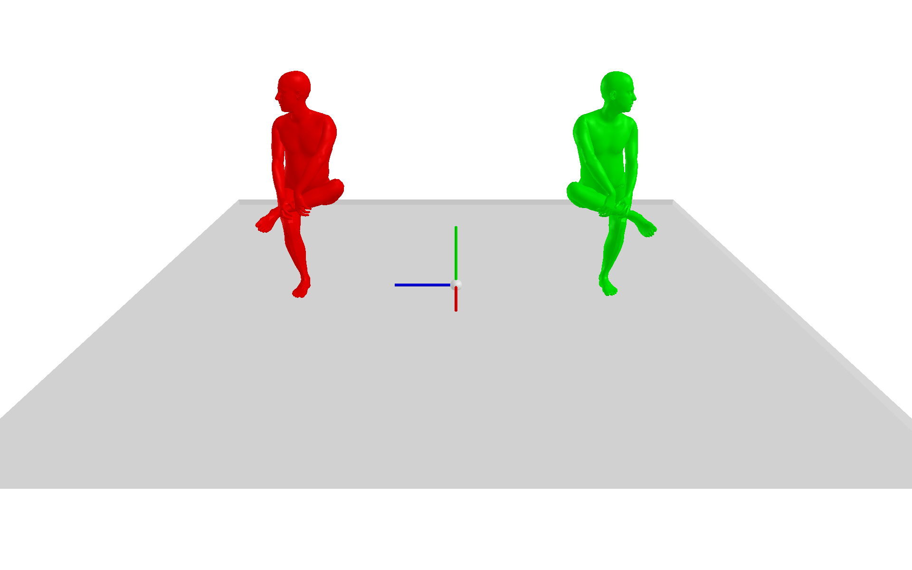

# SMPL Mirror

## Introduction
This project provides a script for mirroring SMPL/SMPL-X parameterized human body models.
The script enables left-right mirroring of the SMPL model, 
allowing for the creation of symmetric SMPL parameter data.


## Usage

1. Install dependencies:

   ```bash
   pip install smplx scipy trimesh

2. Run the script in a torch environment:

   ```
   python smpl_mirror.py
   ```

## Results
Green represents the original, and red represents the mirrored.

<div style="display: flex; flex-wrap: wrap; gap: 10px;">
    
    
    
    
    
    
</div>

## Acknowledgements

This project references the following open-source projects:

- [SMPL-X](https://github.com/vchoutas/smplx): Our human body model is based on SMPL.
- [HumanML3D](https://github.com/EricGuo5513/HumanML3D): We were inspired by the mirror operation from the motion processing pipeline of the [humanmld](https://github.com/humanmld) project.
- [CHAIRS](https://github.com/jnnan/chairs): The motion data presented here is sourced from [https://github.com/jnnan/chairs](https://github.com/jnnan/chairs).
Thanks all.